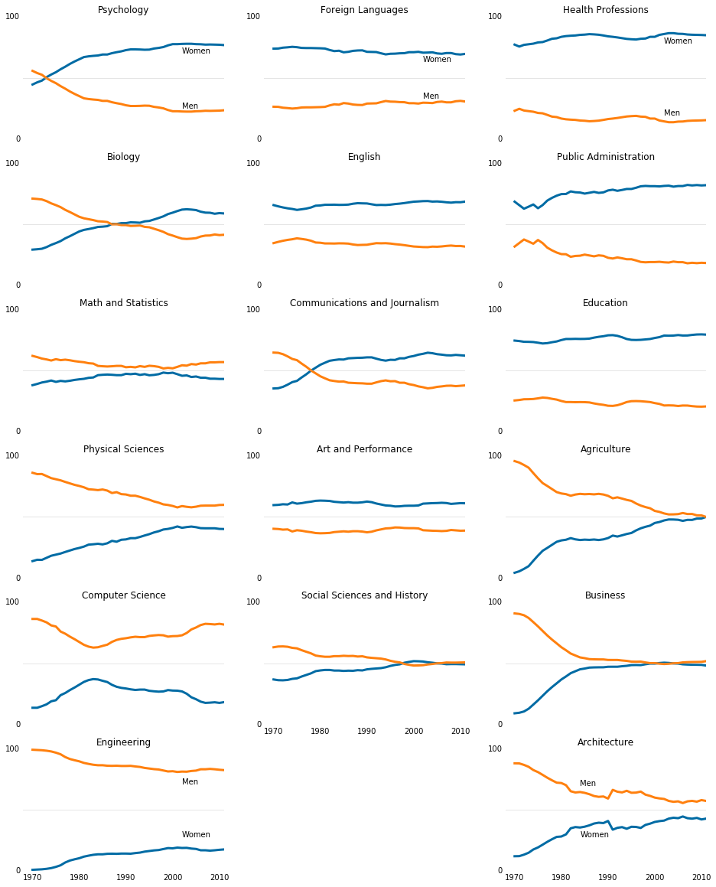

```python
%matplotlib inline
import pandas as pd
import matplotlib.pyplot as plt

women_degrees = pd.read_csv('percent-bachelors-degrees-women-usa.csv')
cb_dark_blue = (0/255,107/255,164/255)
cb_orange = (255/255, 128/255, 14/255)
stem_cats = ['Engineering', 'Computer Science', 'Psychology', 'Biology', 'Physical Sciences', 'Math and Statistics']

fig = plt.figure(figsize=(18, 3))

for sp in range(0,6):
    ax = fig.add_subplot(1,6,sp+1)
    ax.plot(women_degrees['Year'], women_degrees[stem_cats[sp]], c=cb_dark_blue, label='Women', linewidth=3)
    ax.plot(women_degrees['Year'], 100-women_degrees[stem_cats[sp]], c=cb_orange, label='Men', linewidth=3)
    ax.spines["right"].set_visible(False)    
    ax.spines["left"].set_visible(False)
    ax.spines["top"].set_visible(False)    
    ax.spines["bottom"].set_visible(False)
    ax.set_xlim(1968, 2011)
    ax.set_ylim(0,100)
    ax.set_title(stem_cats[sp])
    ax.tick_params(bottom="off", top="off", left="off", right="off")
    
    if sp == 0:
        ax.text(2005, 87, 'Men')
        ax.text(2002, 8, 'Women')
    elif sp == 5:
        ax.text(2005, 62, 'Men')
        ax.text(2001, 35, 'Women')
plt.show()
```


# Plots for all degree categories


```python
stem_cats = ['Psychology', 'Biology', 'Math and Statistics', 'Physical Sciences', 'Computer Science', 'Engineering']
lib_arts_cats = ['Foreign Languages', 'English', 'Communications and Journalism', 'Art and Performance', 'Social Sciences and History']
other_cats = ['Health Professions', 'Public Administration', 'Education', 'Agriculture','Business', 'Architecture']
```


```python
fig = plt.figure(figsize=(16, 20))

## Generate first column of line charts. STEM degrees.
length = len(stem_cats)
for cat in range(1, length+1):
    #print(cat)
    ax = fig.add_subplot(6,3,(cat*3)-2)
    ax.plot(women_degrees['Year'], women_degrees[stem_cats[cat-1]], c=cb_dark_blue, label='Women', linewidth=3)
    ax.plot(women_degrees['Year'], 100-women_degrees[stem_cats[cat-1]], c=cb_orange, label='Men', linewidth=3)
    ax.tick_params(bottom="off", top="off", left="off", right="off", labelbottom = "off")
    if cat == 1:
        ax.text(2002, 25, 'Men')
        ax.text(2002, 70, 'Women')
    elif cat == length:
        ax.text(2002, 71, 'Men')
        ax.text(2002, 28, 'Women')
        ax.tick_params(bottom="off", top="off", left="off", right="off", labelbottom = "on")
    ax.set_xlim(1968, 2011)
    ax.set_ylim(0,100)
    ax.set_yticks([0,100])
    ax.set_title(stem_cats[cat-1])
    ax.axhline(50, c=(171/255, 171/255, 171/255), alpha=0.3)
    for key,spine in ax.spines.items():
        spine.set_visible(False)
    
## Generate second column of line charts. Liberal Arts degrees.
length = len(lib_arts_cats)
for cat in range(1, length+1):
    ax = fig.add_subplot(6,3,(cat*3)-1)
    ax.plot(women_degrees['Year'], women_degrees[lib_arts_cats[cat-1]], c=cb_dark_blue, label='Women', linewidth=3)
    ax.plot(women_degrees['Year'], 100-women_degrees[lib_arts_cats[cat-1]], c=cb_orange, label='Men', linewidth=3)
    ax.tick_params(bottom="off", top="off", left="off", right="off", labelbottom = "off")
    if cat == 1:
        ax.text(2002, 33, 'Men')
        ax.text(2002, 63, 'Women')
    elif cat == length:
        ax.tick_params(bottom="off", top="off", left="off", right="off", labelbottom = "on")
    ax.set_xlim(1968, 2011)
    ax.set_ylim(0,100)
    ax.set_yticks([0,100])
    ax.set_title(lib_arts_cats[cat-1])
    ax.axhline(50, c=(171/255, 171/255, 171/255), alpha=0.3)
    for key,spine in ax.spines.items():
        spine.set_visible(False)
    
## Generate third column of line charts. Other degrees.
length = len(other_cats)
for cat in range(1, length+1):
    ax = fig.add_subplot(6,3,(cat*3))
    ax.plot(women_degrees['Year'], women_degrees[other_cats[cat-1]], c=cb_dark_blue, label='Women', linewidth=3)
    ax.plot(women_degrees['Year'], 100-women_degrees[other_cats[cat-1]], c=cb_orange, label='Men', linewidth=3)
    ax.tick_params(bottom="off", top="off", left="off", right="off", labelbottom = "off")
    if cat == 1:
        ax.text(2002, 19, 'Men')
        ax.text(2002, 78, 'Women')
    elif cat == length:
        ax.text(1984, 70, 'Men')
        ax.text(1984, 28, 'Women')
        ax.tick_params(bottom="off", top="off", left="off", right="off", labelbottom = "on")
    ax.set_xlim(1968, 2011)
    ax.set_ylim(0,100)
    ax.set_yticks([0,100])
    ax.set_title(other_cats[cat-1])
    ax.axhline(50, c=(171/255, 171/255, 171/255), alpha=0.3)
    for key,spine in ax.spines.items():
        spine.set_visible(False)
        
# Export file before calling pyplot.show()
fig.savefig("gender_degrees.png")
plt.show()
```




